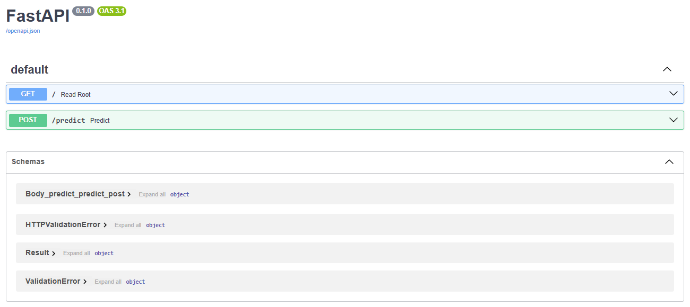

# mlops-dsr-batch-43
FastAPI endpoint for a fruit classifier


# Run the app

Local run (hot-reload):

```
fastapi run app/main.py --host 0.0.0.0 --port 8080 --reload
```

Open the interactive docs at:

- http://localhost:8080/docs

Example prediction request:

```
curl -X POST "http://localhost:8080/predict" \
  -H "accept: application/json" \
  -H "Content-Type: multipart/form-data" \
  -F "input_image=@path/to/your/image.jpg"
```

## Docker

Build the image:

```
docker build -t fruit-api .
```

Run the container:

```
docker run -p 8080:8080 \
  -e WANDB_API_KEY=YOUR_KEY \
  -e WANDB_ORG=your_org \
  -e WANDB_PROJECT=your_project \
  -e WANDB_MODEL_NAME=resnet18 \
  -e WANDB_MODEL_VERSION=v1 \
  fruit-api
```

Then open:

- http://localhost:8080/docs


